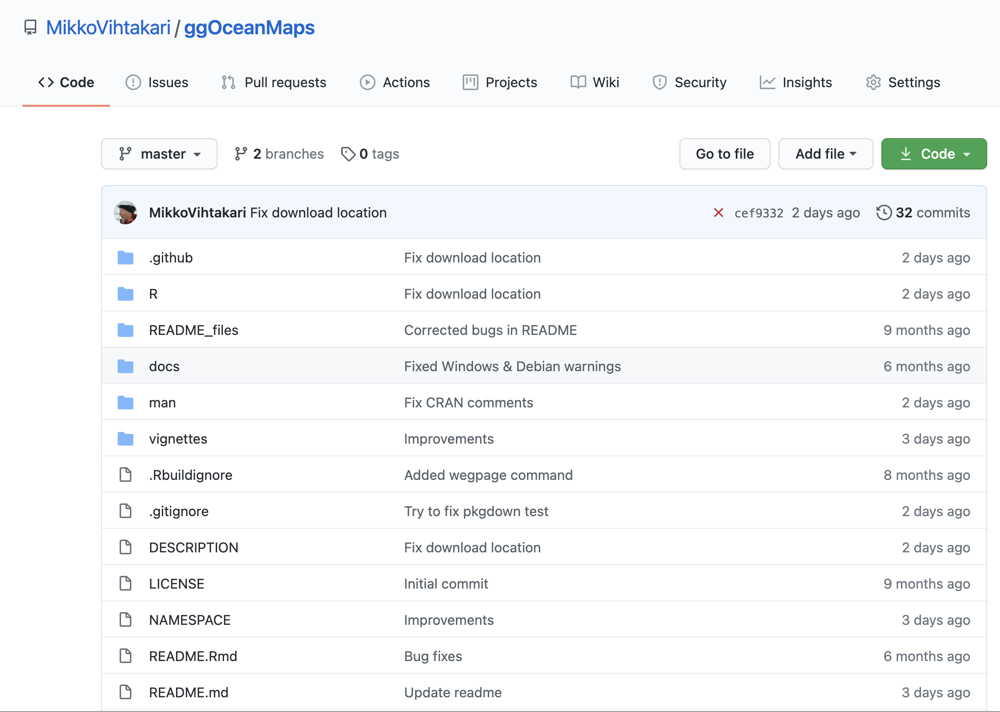
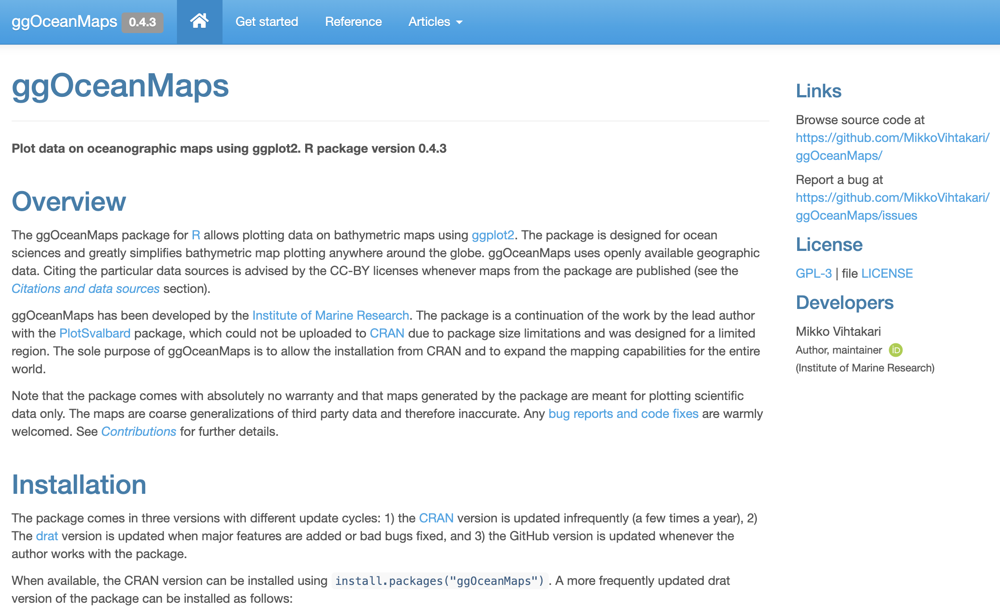
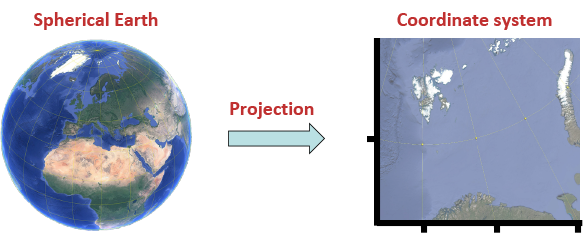
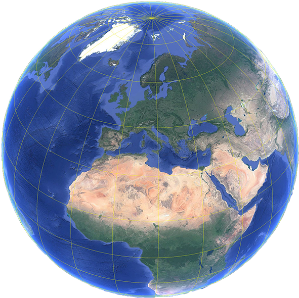
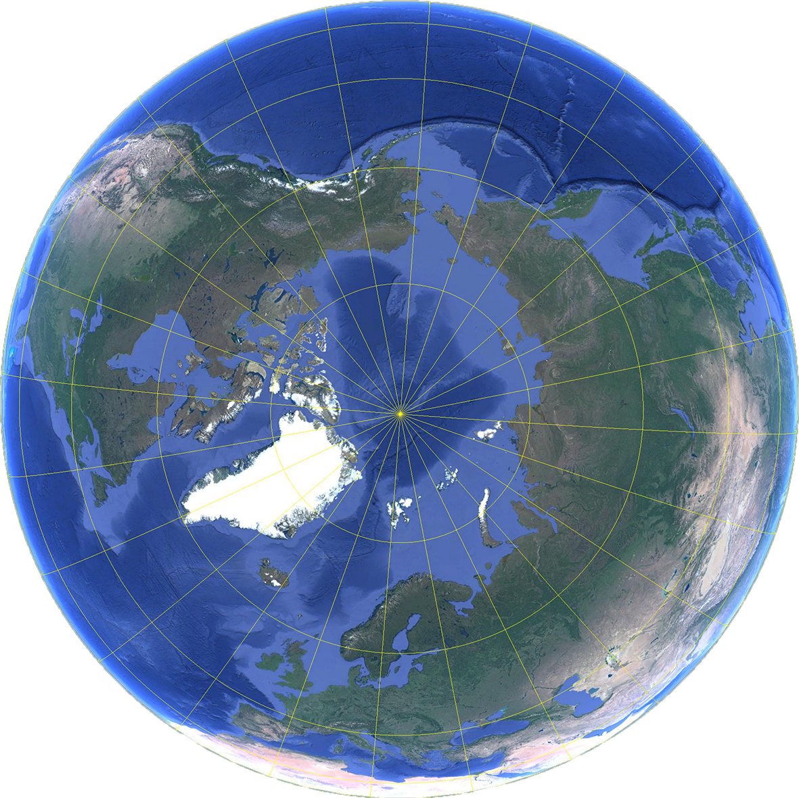
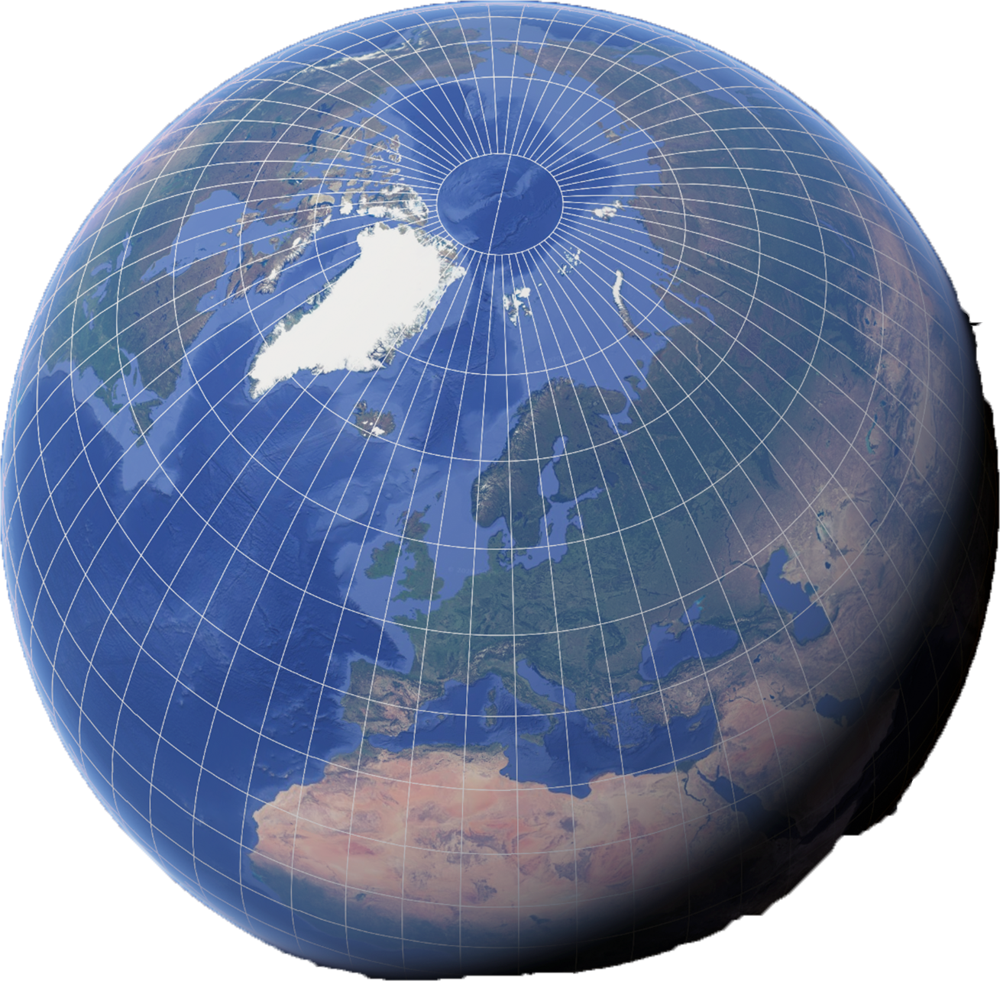
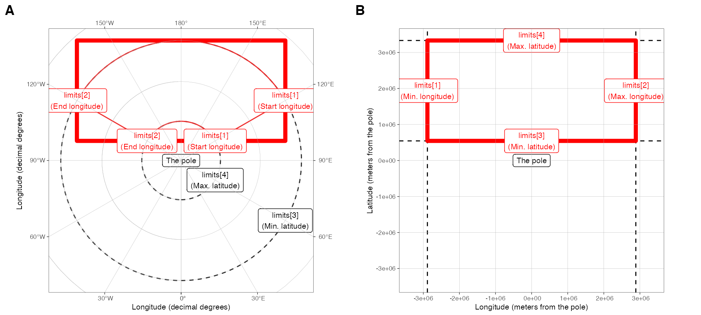

layout: true
class: split-three

```{r setup, include=FALSE}
options(htmltools.dir.version = FALSE)
library(knitr)
library(ggOceanMaps)

knitr::opts_chunk$set(message = FALSE,
                      warning = FALSE
)

```

.row[.content[
# ggOceanMaps - plot data on oceanographic maps using ggplot2

Research data from anywhere around the globe can be plotted on bathymetric maps using ggplot2 syntax and extensions.
.center[https://github.com/MikkoVihtakari/ggOceanMaps]
]]

.row[.content[
  .split-three[
  .column[.content[
The package is available on [CRAN](https://cran.r-project.org/web/packages/ggOceanMaps)
  <br> <br>
  
```{r, echo = FALSE, out.width="70%", fig.align="center"}
knitr::include_graphics("https://www.r-project.org/logo/Rlogo.png")
```

  ]]
  .column[.content[

The [GitHub version](https://github.com/MikkoVihtakari/ggOceanMaps) is updated more frequently
  
```{r, echo = FALSE}

```

  ]]
  .column[.content[

[Website](https://mikkovihtakari.github.io/ggOceanMaps/index.html) with documentation, [function reference](https://mikkovihtakari.github.io/ggOceanMaps/reference/index.html) and [user manual](https://mikkovihtakari.github.io/ggOceanMaps/articles/ggOceanMaps.html)
  
```{r, echo = FALSE}
 
```


  ]]
]
]]

???
Add logo?

---
class: hide-col2 hide-col3

---
class: hide-col3
count: false

---
count: false

---
layout: false
class: split-33 compact

.column[.content[

```{r, echo = FALSE, fig.width=10, fig.height=10, dpi = 300}
basemap(limits = 60)
```

Note that ggOceanMaps .red[**does not work**] together with PlotSvalbard `if("package:PlotSvalbard" %in% search()) { detach("package:PlotSvalbard", unload=TRUE) }`


]]

.column[.content[

# Setting up ggOceanMaps

Required packages and installation

```{r eval = FALSE}
packages <- c("devtools", "ggOceanMapsData", "ggOceanMaps")

## Install packages not yet installed
inst_packages <- packages %in% rownames(installed.packages())
if (any(!inst_packages)) {
  install.packages(packages[!inst_packages],
          repos = c("https://cloud.r-project.org",
                    "https://mikkovihtakari.github.io/drat")
  )
}

## Load the packages to namespace
invisible(lapply(packages, library, character.only = TRUE))

basemap(60)
```

]]


---
class: inverse

.pull-left[
# Outline

1. GIS in R briefly
2. ggOceanMaps basics
3. Advanced ggOceanMaps example
4. Other mapping packages briefly

Start a .red[new script in R studio] and keep it open
]

.pull-right[
## Searching for help

- [?](https://www.rdocumentation.org/packages/utils/versions/3.6.2/topics/Question)
- [??](https://www.rdocumentation.org/packages/utils/versions/3.6.2/topics/help.search)
- Google and StackExchange
- [ggplot2 cheat sheet](https://rstudio.com/resources/cheatsheets/)
- [GIS in R cheat sheet](https://www.maths.lancs.ac.uk/~rowlings/Teaching/UseR2012/cheatsheet.html)
]

---
layout: false
class: inverse, center, middle

# A short introduction to GIS

---
class: inverse
background-image: url(Figures/gg_idea.png)
background-size: 100%

---
layout: true
class: split-33 with-border

.column.inverse[.content.vmiddle[
  ## According to grammar of graphics variables are "mapped" to a coordinate system that can be defined freely
]]

.column[
.split-two[
.column[.content[
  .split-two[
  .row[.content[
  
.indigo[**1 Data**]
  
```{r, echo = FALSE}
dt <- data.frame(A = c(2,1,4,9), B = c(3,2,5,2), C = rep(letters[1:2], each = 2))
knitr::kable(dt)
```
  ]]
  .row[.content[
  
.indigo[**3 Aesthetics (appearance of points)**]
  
```{r, echo = FALSE, fif.height = 4.5}
ggplot(data = dt, aes(x = A, y = B, shape = C)) + 
  geom_point(size = 10) + 
  theme_void(base_size = 30) + 
  theme(plot.margin = unit(c(1,1,10,4), "cm"))
```
  
  ]]
]]]

.column[.content[
  .split-two[
  .row[.content[
  
.indigo[**2 Coordinate system**]
  
```{r, echo = FALSE, fig.height = 4.5}
ggplot(data = dt, aes(x = A, y = B)) + 
  geom_blank() + 
  theme_classic(base_size = 30) +
  theme(plot.margin = unit(c(0,4,1,0), "cm"))
```
  ]]
  .row[.content.vmiddle[
  
.indigo[**4 Final plot**]
  
```{r, echo = FALSE, fig.height = 4.5}
ggplot(data = dt, aes(x = A, y = B, shape = C)) + 
  geom_point(size = 10) + 
  theme_classic(base_size = 30)  + 
  theme(plot.margin = unit(c(0,0,1,0), "cm"))
```

  ]]
]]]
]]

---
class: hide-row1 hide-row2

---
class: hide-row2
count: false

---
class: fade-row1
count: false

---
layout: false

## Maps can be considered as canvases for graphics but their coordinate systems stem from geographic positions of data defined by a **projection**

.pull-left[

.indigo[**A projected coordinate system <br> (polar stereographic = meters from the North Pole)**]
  
```{r, echo = FALSE, fig.height=4.5, dpi = 300}
ggplot() + 
  expand_limits(x = c(-2e6, 2e6), y = c(-2e6, 2e6)) +
  labs(y = "Latitude (meters from the pole)", x = "Longitude (meters from the pole)") +
  coord_sf(crs = 3995, datum = 3995) +
  theme_map(grid.col = "grey70", grid.size = 0.1, base_size = 20)
```

]

--

.pull-right[

.indigo[**Non-projected angular coordinate system <br> (decimal degrees = a position on the surface of a 3D sphere)**]

```{r, echo = FALSE, fig.height=4.5, dpi = 300}
ggplot() + 
  ggspatial::geom_spatial_point(data = data.frame(lon = c(0, 90, 180, -90), lat = c(60, 60, 60, 60)), aes(x = lon, y = lat), crs = 4326, color = NA) +
  scale_x_continuous("Longitude (decimal degrees)", breaks = seq(0, 360, 30)) +
  ylab("Longitude (decimal degrees)") +
  coord_sf(crs = 3995, label_axes = "EEEE") +
  theme_map(grid.col = "grey70", grid.size = 0.1, base_size = 20)
```

]

---
layout: true
class:split-33

.column.bg-main1[.content[
## .center[Exercise]

The decimal degree coordinates of Nordic capitals are Helsinki (60.2 $^\circ$N, 24.9 $^\circ$E), Stockholm (59.3 $^\circ$N, 18.1 $^\circ$E), Copenhagen (55.7 $^\circ$N, 12.6 $^\circ$E), Oslo (59.9 $^\circ$N, 10.8 $^\circ$E), and Reykjavik (64.1 $^\circ$N, 21.9 $^\circ$W). Plot the position of these capitals on a decimal degree grid using points in ggplot2 and map the color of the points to their name. 

]]

.column[.content[

```{r, fig.height = 4.5, fig.width = 10, fig.align="center", dpi = 300}
dt <- data.frame(
  name = c("Helsinki", "Stockholm", "Copenhagen", "Oslo", 
           "Reykjavik"), 
  lat = c(60.2, 59.3, 55.7, 59.9, 64.1), 
  lon = c(24.9, 18.1, 12.6, 10.8, -21.9)
)

ggplot(dt, aes(x = lon, y = lat, color = name)) +
  geom_point(size = 3) + theme_bw(base_size = 20)
```


]]

---
class: hide-col2

---
count: false

---
layout: false

## Maps are 2D presentations of a surface of a sphere

```{r, fig.align="center", echo = FALSE}

```

.pull-left[
Projections always reduce information <br>
**Conformal**: preserves angles <br>
**Isometric**: preserves distances
]

.pull-right[
A projection **cannot be conformal and isometric at the same time** all over a map, but narrow maps can be close.
]

---
class: col-3 compact inverse

# Projections are approximations. Each has their use

## Decimal degree

- Not a projection if not plotted
- Unit: **degrees** on a sphere
- Preserves **angles**
- Not suitable for maps where distances matter

```{r, fig.align="center", echo = FALSE}

```

## Polar stereographic

- Unit: **meters** from the North Pole
- Preserves **angles**
- Preserves distances 
- Preserves distances along a plane at 71 $^\circ$N

```{r, fig.align="center", echo = FALSE}

```

### Universal Transverse Mercator<br>(UTM)

- Unit: **meters** along Earth’s surface
- Preserves **distances** within a zone
- Not suitable for wide maps
<br><br>


```{r, fig.align="center", echo = FALSE}

```

---
layout: true
class:split-33

.column.bg-main1[.content[
## .center[Exercise]

Add coastlines as geom_path() to the capital plot you made in the previous exercise. The coastlines can be found from the [rnaturalearthdata](https://cran.r-project.org/web/packages/rnaturalearthdata/index.html) package (coastline50)

]]

.column[.content[

```{r echo = FALSE}
dt <- data.frame(
  name = c("Helsinki", "Stockholm", "Copenhagen", "Oslo", "Reykjavik"), 
  lat = c(60.2, 59.3, 55.7, 59.9, 64.1), 
  lon = c(24.9, 18.1, 12.6, 10.8, -21.9)
)
```

```{r eval = FALSE}
install.packages("rnaturalearthdata")
```

```{r, fig.height = 4, fig.width = 10, fig.align="center", dpi = 300}
ggplot() +
  geom_path(data = rnaturalearthdata::coastline50, 
    aes(x = long, y = lat, group = group)) +
  geom_point(data = dt, 
             aes(x = lon, y = lat, color = name), 
             size = 3) + 
  coord_map(xlim = range(dt$lon), ylim = range(dt$lat)) +
  theme_bw(base_size = 20) + 
  theme(plot.margin = unit(c(0,0,1,0), "cm"))
```

]]

---
class: hide-col2

---
count: false

---
layout: false
class: compact

# GIS in R on one slide

.pull-left[
Packages:

```{r eval = FALSE}
library(sp)  # vector data
library(raster) # raster data
library(rgdal) # input/output, projections
library(rgeos) # geometry operations
library(sf) # simplifies GIS in R
library(ggspatial) # shapefiles in ggplot2
```

Vector classes:
```{r eval = FALSE}
?sp::SpatialPolygons
?sp::SpatialPoints
?sp::SpatialLines
```
]

.pull-right[
Coordinate reference system:

```{r eval = FALSE}
sp::CRS("EPSG:4326") # Decimal degrees
sf::st_crs(4326) # sf way to get the same
sp::CRS("EPSG:3995") # Arctic stereographic
sp::CRS("EPSG:3031") # Antarctic stereographic
```

Raster classes:
```{r eval = FALSE}
?raster::raster
?sp::SpatialGrid
```

]

See more: https://www.maths.lancs.ac.uk/~rowlings/Teaching/UseR2012/cheatsheet.html

---
layout: false
class: inverse, center, middle

# ggOceanMaps - ggplot2 mapping made easy

---
class: col-3 compact tinycode

# basemap(...) makes a map canvas. One of the following arguments are required:

### .red[**limits**] (numeric) 
sets the limits for a map. Can be:
  - **single integer** in decimal degrees makes a polar map
  - **numeric vector of length 4** makes a square map

```{r, fig.align="center", fig.height = 5}
basemap(limits = 60)
```

### .red[**data**] (object name)
lets a dataset to define the limits automatically
  - data.frame or SpatialPolygons **object name**

```{r, fig.align="center", fig.height = 5, fig.width = 10}
basemap(data = dt)
```

<br>

### .red[**shapefiles**] (character) 
plots shapefiles
  - Name of a predefined or custom shapefile_list()
  - Required if limits are supplied as projected coordinates

```{r, fig.align="center", fig.height = 4}
basemap(limits = c(-2e6, 2e6, -2e6, 2e6),
        shapefiles = "Arctic")
```

---
class: img-left-full compact

# The .red[limits] argument

- .indigo[**single integer**] in decimal degrees makes a polar map

```{r, fig.height=10, fig.width=10, dpi = 300}
basemap(limits = 60)
```

---
class: img-left-full compact
count: false

# The .red[limits] argument

.gray[
- **single integer** in decimal degrees makes a polar map

```{r, eval = FALSE, dpi = 300}
basemap(limits = 60)
```
]

- .indigo[**numeric vector of length 4**] makes a square map

```{r, fig.height=10, fig.width=10, dpi = 300}
basemap(limits = c(-20, 20, 55, 80))
```

---
class: img-left-full compact
count: false

# The .red[limits] argument

.gray[
- **single integer** in decimal degrees makes a polar map

```{r, eval = FALSE}
basemap(limits = 60)
```

- **numeric vector of length 4** makes a square map

```{r, eval = FALSE}
basemap(limits = c(-20, 20, 55, 80))
```
]

- .indigo[**numeric vector of length 4**] in projected coordinates requires specifying the .red[**shapefiles**] argument (or supplying .red[data])

```{r, fig.height=10, fig.width=10, dpi = 300}
basemap(limits = c(-2e6, 2e6, -2e6, 2e6),
        shapefiles = "Arctic")
```

---
class: img-caption



The numeric limits vector is defined in the order 1) min/start longitude, 2) max/end longitude, 3) min latitude, 4) max latitude. The meaning depends on the projection.

---
class: inverse

# Exercise

Use the ggOceanMaps website (https://mikkovihtakari.github.io/ggOceanMaps/) to solve following exercises.

1) Plot the Antarctica using a Antarctic Polar Stereographic projection and a cut point at 60 $^\circ$S. 

2) Add glaciers and bathymetry to the map

.gray[
3) Plot the capitals in previous examples using ggOceanMaps and the data argument to limit the map. Add bathymetry, remove bathymetry legend and change the latitude grid interval to 2 degrees.

4) Make the same plot using the qmap() function.
]

---
class: img-left-full

```{r, echo = FALSE, dpi = 300}
basemap(-60, bathymetry = TRUE, glaciers = TRUE)
```

# Bathymetry and glaciers

The logical `bathymetry` and `glaciers` arguments add these to `basemap()`

The .red[bathymetry style] can be adjusted using the `bathy.style` argument or by using ggplot's `scale_*` functions. See the [User Manual](https://mikkovihtakari.github.io/ggOceanMaps/articles/ggOceanMaps.html#appearance-1).

```{r, eval = FALSE}
basemap(-60, bathymetry = TRUE, glaciers = TRUE)
```

The bathymetry .red[legend can be removed] using the `legends` argument.  

---
class: inverse

# Exercise

Use the ggOceanMaps website (https://mikkovihtakari.github.io/ggOceanMaps/) to solve following exercises.

.gray[
1) Plot the Antarctica using a Antarctic Polar Stereographic projection and a cut point at 60 $^\circ$S. 

2) Add glaciers and bathymetry to the map
]

3) Plot the capitals in previous examples using ggOceanMaps and the data argument to limit the map. Add bathymetry, remove bathymetry legend and change the latitude grid interval to 2 degrees.

.gray[
4) Make the same plot using the qmap() function.
]

---
class: compact

# The .red[data] argument

.pull-left[

- Supply a data.frame to automatically limit the map to the data

```{r, fig.height=5, fig.width=10, dpi = 300}
basemap(data = dt)
```

]

--

.pull-right[

- The function uses `guess_coordinate_columns()` to guess the columns. This algorithm is not very advanced and simple names for the coordinate columns are suggested.

```{r}
head(dt, 2)
guess_coordinate_columns(dt)
```

]


---
class: compact

.pull-left[

# Adding data layers to basemaps

Data can be added as ggplot layers, but:

- The `data` argument .red[**must**] be specified
- Data coordinates have to be in the same projection than the `basemap()`
  - Use the [`transform_coord()`](https://mikkovihtakari.github.io/ggOceanMaps/reference/transform_coord.html) function OR
  - The [ggspatial](https://CRAN.R-project.org/package=ggspatial) package
]

.pull-right[

```{r eval = FALSE}
basemap(data = dt, bathymetry = TRUE,
        legends = FALSE, lat.interval = 2) +
geom_spatial_point(data = dt, #<<
                   aes(x = lon, y = lat,
                       color = name)
                   ) 
# OR
geom_point(`data = transform_coord(dt)`, 
           aes(x = lon, y = lat, color = name)
           )
```

```{r echo = FALSE, fig.height=5, fig.width=10, dpi = 300}
basemap(data = dt, bathymetry = TRUE, legends = FALSE, lat.interval = 2, base_size = 16) +
  geom_spatial_point(data = dt, aes(x = lon, y = lat, color = name), size = 5)
```
]

---
class: compact

# Rotating maps

.pull-left[
- The maps polar stereographic can be rotated to point north (or south) using the `rotate` argument
- Note that rotation changes the underlying projection of the map, which has to be taken into account in data plotting
- The rotation algorithm is still bugged and may produce unexpected results (as in the example)
]

.pull-right[
```{r fig.height=5, fig.width=10, dpi = 300}
basemap(limits = c(-21.9, 10.8, 55.7, 64.1), 
        rotate = TRUE) +
  geom_spatial_point(data = dt, 
                     aes(x = lon, y = lat, 
                         color = name)
                     )
```
]

---
class: inverse

# Exercise

Use the ggOceanMaps website (https://mikkovihtakari.github.io/ggOceanMaps/) to solve following exercises.

.gray[
1) Plot the Antarctica using a Antarctic Polar Stereographic projection and a cut point at 60 $^\circ$S. 

2) Add glaciers and bathymetry to the map

3) Plot the capitals in previous examples using ggOceanMaps and the data argument to limit the map. Add bathymetry, remove bathymetry legend and change the latitude grid interval to 2 degrees.
]

4) Make the same plot using the qmap() function.

---
class: compact

# The .red[qmap()] - a basemap shortcut

.pull-left[

- The `qmap()` function is meant as a quick way to check positions of data
- Non-mapped variables need to be escaped using the `I()` similarly to `qplot()`

```{r, fig.height=5, fig.width=10, dpi = 300}
qmap(dt, color = name, size = I(5))
```

]

--

.pull-right[

```{r, fig.height=5, fig.width=10, dpi = 300}
qmap(dt, color = I("red"), size = I(5))
```

]

---
class: split-two

.column[.content[
# Detailed maps

- Not included in ggOceanMapsData. Must be downloaded.
- Setting the .red[**data path**] is advised. See [here](https://github.com/MikkoVihtakari/ggOceanMaps#data-path).
- More shapefiles will be added and existing ones improved

```{r cache=TRUE, fig.height=4, fig.width=9, dpi = 300}
basemap(limits = c(10.9, 12.65, 78.83, 79.12), 
        bathymetry = TRUE, shapefiles = "Svalbard",
        legends = FALSE)
```
]]

.column[.content[
```{r cache=TRUE, fig.height = 7, fig.width=8, dpi = 300}
basemap(shapefiles = "Svalbard", 
        bathymetry = TRUE, legends = FALSE)

```
]]

---
class: split-33 tinycode

.column.inverse[.vmiddle.content[
Usage:
```{r, fig.height=4, cache = TRUE, dpi = 300}
basemap(shapefiles = "Decimal")
```
]]

.column[.content[
# Shapefiles and map types

- All shapefiles included in ggOceanMaps:

```{r}
shapefile_list("all")
```

.center[If a shapefile you need does not exist, .red[you can make it!]]

]]

---
class: inverse, center, middle

# Advanced ggOceanMaps

---
class: inverse compact tinycode

# Projections and how to code them

http://epsg.io/ is a nice resource

.pull-left[
## PROJ4 (old system)

```{r message = TRUE, warning = TRUE}
sp::CRS("+init=epsg:4326")
```

]

.pull-right[
## PROJ6 (current rgdal system)

```{r message = TRUE, warning = TRUE}
sp::CRS("EPSG:4326")
```

]

Synonyms at the moment of writing, but not in all R and sp package versions. Note that the actual new information has been hidden behind comment():

```{r message = TRUE, warning = TRUE}
comment(sp::CRS("EPSG:4326"))
```

.center[See [here](https://gis.stackexchange.com/questions/374508/spproj4string-equivalent-in-the-proj6-framework) to understand the mess]


---
background-image: url(Figures/ggOceanMaps_projections.png)
background-size: cover

.pull-right[
.content-box-grey[
# Projections
At the time of writing, `basemap()` uses the following projections:

- .red[**3995** (Arctic Polar Stereographic)]
- .green[**4326** (Decimal Degree)]
- .blue[**3031** (Antarctic Polar Stereographic)]

CRAN version still bugged for wide maps. I.e `limits[4] >= 60 & limits[3] <= 30`.
]
]

---
class: inverse

# Exercise

Use the ggOceanMaps website (https://mikkovihtakari.github.io/ggOceanMaps/) and Google to solve following exercise:

Make custom shapefiles for the Barents Sea with limits c(0, 53, 70, 82) out of the [ETOPO1 dataset (bathymetry)](https://www.ngdc.noaa.gov/mgg/global/relief/ETOPO1/data/ice_surface/grid_registered/netcdf/) and the [Natural Earth Data 10m land polygons](http://www.naturalearthdata.com/downloads/10m-physical-vectors/) using the [UTM zone 36N projection](http://epsg.io/32636). Add [ocean currents](https://github.com/MikkoVihtakari/Barents-Sea-currents) to the plot.

---
class: split-33 compact

.column[.content[
# Custom shapefiles

Bathymetry data in ggOceanMaps are downloaded from [ETOPO 1 Arc-Minute Global Relief Model](https://www.ngdc.noaa.gov/mgg/global/relief/ETOPO1/data/ice_surface/grid_registered/netcdf/)

These are grid (raster) data and need to be vectorized (made to shapefiles)

Download the file and place the path to the `etopoPath` object

If you want more detailed bathymetry, you can also use:
 - [GEBCO 15-arcsecond model](https://www.gebco.net/data_and_products/gridded_bathymetry_data/gebco_2019/gebco_2019_info.html)
 - [Geonorge.no](https://kartkatalog.geonorge.no/metadata/kartverket/dybdedata/2751aacf-5472-4850-a208-3532a51c529a)
]]

.column[.content[

```{r echo = FALSE}
map.limits <- c(0, 53, 70, 82)
bound.limits <- c(-25, 75, 65, 84)
projection <- "+init=epsg:32636"
```

```{r eval = FALSE}
etopoPath <- "Path/To/The/ETOPO/folder" 
map.limits <- c(0, 53, 70, 82)
bound.limits <- c(-25, 75, 65, 84)
projection <- "+init=epsg:32636"

## Bathymetry

rb <- raster_bathymetry(bathy = 
            paste(etopoPath, "ETOPO1_Ice_g_gmt4.grd", sep = "/"),
          depths = 
           c(50, 100, 200, 300, 400, 500, 750, 1000, 1500, 2000, 
             3000, 4000, 5000, 6000, 10000), 
           proj.out = projection, 
           boundary = bound.limits
)

bs_bathy <- vector_bathymetry(rb)
```
]]

---
class: split-33 compact

.column[.content[
# Land shapes

- Land shapes have been downloaded from [Natural Earth Data](http://www.naturalearthdata.com/downloads/10m-physical-vectors/). 

- Download "Land" and "Minor Islands" and unzip. Place into a folder.

- These are already shapefiles and only require vectorizing.

]]

.column[.content[
```{r eval = FALSE}
NEDPath <- "Path/To/The/NED/folder" # Natural Earth Data location

world <- rgdal::readOGR(
  paste(NEDPath, "ne_10m_land/ne_10m_land.shp", sep = "/")
  )
islands <- rgdal::readOGR(
  paste(NEDPath, "ne_10m_minor_islands/ne_10m_minor_islands.shp", 
        sep = "/")
  )
world <- rbind(world, islands)

bs_land <- clip_shapefile(world, bound.limits)
bs_land <- sp::spTransform(bs_land, CRSobj = sp::CRS(projection))
rgeos::gIsValid(bs_land) # Has to return TRUE, if not use rgeos::gBuffer
bs_land <- rgeos::gBuffer(bs_land, byid = TRUE, width = 0)
```
]]

---
class: split-33 compact

.column[.content[
# Glacier shapes

- Also the glacier shapes come from the [Natural Earth Data](http://www.naturalearthdata.com/downloads/10m-physical-vectors/). 

- Download "Glaciated areas" and unzip. Place into the NED folder.

]]

.column[.content[
```{r eval = FALSE}
glaciers <- rgdal::readOGR(
  paste(NEDPath,"ne_10m_glaciated_areas/ne_10m_glaciated_areas.shp", 
        sep = "/")
  )
rgeos::gIsValid(glaciers) # Needs buffering?
glaciers <- rgeos::gBuffer(glaciers, byid = TRUE, width = 0)

bs_glacier <- clip_shapefile(glaciers, bound.limits)
bs_glacier <- sp::spTransform(bs_glacier, CRSobj = sp::CRS(projection))
rgeos::gIsValid(bs_glacier)
```
]]

---
class: img-left-full

```{r, cache=TRUE, echo = FALSE, dpi = 300}
x <- load_map_data(shapefile_list("Barents"))

sp::plot(x$barentssea_bathy, col = "blue")
sp::plot(x$barentssea_land, col = "red", add = TRUE)
sp::plot(x$barentssea_glacier, col = "green", add = TRUE)
```

The components are now shapefiles and can be plotted using the sp package

```{r eval = FALSE}
sp::plot(bs_bathy, col = "blue")
sp::plot(bs_land, col = "red", add = TRUE)
sp::plot(bs_glacier, col = "green", add = TRUE)
```

---
class: img-left-full compact

```{r cache = TRUE, echo = FALSE, dpi = 300}
basemap(shapefiles = "Barents", bathymetry = TRUE, glaciers = TRUE)
```

Or using the ggOceanMaps

```{r eval = FALSE}
basemap(
  shapefiles = list(land = bs_land, glacier = bs_glacier, bathy = bs_bathy), 
  bathymetry = TRUE, glaciers = TRUE)
```

---
class: img-left-full

```{r cache = TRUE, echo = FALSE, dpi = 300}
p <- basemap(limits = map.limits, shapefiles = "Barents", bathymetry = TRUE, glaciers = TRUE, legends = FALSE)
print(p)
```

The basemap asked for in the exercise

```{r eval = FALSE}
p <- basemap(limits = map.limits, 
        shapefiles = 
          list(land = bs_land, 
               glacier = bs_glacier, 
               bathy = bs_bathy),
        bathymetry = TRUE, glaciers = TRUE, 
        legends = FALSE)
p
```

---
class: compact

Adding the currents

```{r}
path <- paste0("https://github.com/MikkoVihtakari/Barents-Sea-currents/",
              "raw/master/tabular/barents_currents.csv") # To make the url fit

cur <- read.csv(path)
cur <- transform_coord(cur, proj.out = projection, bind = TRUE)

## Plot the limits (required for the xspline function)
lims <- auto_limits(expand.grid(data.frame(lon = bound.limits[1:2], lat = bound.limits[3:4])), 
                    proj.out = projection)$projBound
sp::plot(lims)

## Run xspline through the nodes

tp <- lapply(unique(cur$group), function(j) {
  tmp <- cur[cur$group == j,]
  bla <- xspline(x = tmp$lon.proj, y = tmp$lat.proj, shape = -0.6, draw = FALSE)
  data.frame(long = bla$x, lat = bla$y, group = j, size = unique(tmp$size), type = unique(tmp$type))
})

cur <- do.call(rbind, tp)
```

---
class: img-left-full compact

```{r echo = FALSE, dpi = 300}
p + geom_path(
      data = cur, 
      aes(x = long, y = lat, group = group, color = type, 
          size = size),
      arrow = arrow(type = "open", angle = 15, 
                    ends = "last", length = unit(0.3, "lines"))
  ) + 
  scale_color_manual(
    name = "Current\ntype", 
    values = c("Arctic" = "blue", "Atlantic" = "red"), 
    guide = guide_legend(order = 2, override.aes = list(fill = NA))
  ) +
  scale_size(
    name = "Current\nsize", range = c(LS(0.5), LS(3)), breaks = 1:5, 
    labels = c("Intermittent", "Minor", "Medium", "Major", "Main"), 
    guide = guide_legend(order = 3, override.aes = list(fill = NA))
  )
```

Add the currents to the map

```{r eval = FALSE}
p + geom_path(data = cur, 
      aes(x = long, y = lat, group = group, color = type, 
          size = size),
      arrow = arrow(type = "open", angle = 15, 
                    ends = "last", 
                    length = unit(0.3, "lines"))
  ) + 
  scale_color_manual(
    name = "Current\ntype", 
    values = c("Arctic" = "blue", "Atlantic" = "red"), 
    guide = guide_legend(order = 2,
            override.aes = list(fill = NA))
  ) +
  scale_size(
    name = "Current\nsize", range = c(LS(0.5), LS(3)), 
    breaks = 1:5, labels = c("Intermittent", "Minor",
                          "Medium", "Major", "Main"), 
    guide = guide_legend(order = 3, 
                         override.aes = list(fill = NA)
                         )
  )
```

---
class: inverse, center, middle

# Other mapping packages in R

---
# leaflet - make interactive maps

```{r eval = FALSE}
library(leaflet)

 leaflet(dt) %>% 
   addTiles(urlTemplate = paste0("https://server.arcgisonline.com/ArcGIS/",
      "rest/services/Ocean_Basemap/MapServer/tile/{z}/{y}/{x}"),
   attribution = paste0("Tiles &copy; Esri &mdash; Sources: ",
   "GEBCO, NOAA, CHS, OSU, UNH, CSUMB, National Geographic, ",
   "DeLorme, NAVTEQ, and Esri")) %>% 
    addCircleMarkers(lat = ~ lat, lng = ~ lon, 
      weight = 1, radius = 5, 
      popup = ~as.character(name), 
      label = ~as.character(name), 
      color = "red", fillOpacity = 0.5
 )

```
---
# leaflet - the resulting map

```{r out.width='100%', fig.height=6, eval=require('leaflet'), echo = FALSE}
library(leaflet)

 leaflet(dt) %>% 
   addTiles(urlTemplate = "https://server.arcgisonline.com/ArcGIS/rest/services/Ocean_Basemap/MapServer/tile/{z}/{y}/{x}",
   attribution = "Tiles &copy; Esri &mdash; Sources: GEBCO, NOAA, CHS, OSU, UNH, CSUMB, National Geographic, DeLorme, NAVTEQ, and Esri") %>% 
    addCircleMarkers(lat = ~ lat, lng = ~ lon, 
      weight = 1, radius = 5, 
      popup = ~as.character(name), 
      label = ~as.character(name), 
      color = "red", fillOpacity = 0.5
 )
```
---
class: img-left-full


# Other alternatives

- [**marmap**](https://cran.r-project.org/web/packages/marmap/vignettes/marmap.pdf) downloads and plots bathymetric maps but uses raster data. Works for base and ggplot2 plotting.
- [**oceanmap**](https://ro-allen.github.io/oceanmap.html) similar to ggOceanMaps but for base plotting.
- [**oce**](https://cran.r-project.org/web/packages/oce/vignettes/map_projections.html) for oceanography but also makes maps (in base R). The maps do not have (very) high resolution by default. 
- [**tmap**](https://cran.r-project.org/web/packages/tmap/vignettes/tmap-getstarted.html) great mapping for land.

.center[And many, many, others. See [here](https://geocompr.robinlovelace.net/adv-map.html), [here](https://eriqande.github.io/rep-res-web/lectures/making-maps-with-R.html), or Google.]

---
class: inverse, center, middle

# Still time?

--

Let's trash a map with pies!

<div class="right-text-header">
  <p>..because why not?! Every ecologist loves pie-charts!</p>
</div>


---
class: compact

```{r}
# Packages required for the example
# Install veganUtils from https://github.com/MikkoVihtakari/veganUtils

library(tidyverse)
library(reshape2)
library(ggimage)
library(gtable)
library(veganUtils) # to italize species names
library(ggtext) # to plot markdown syntax 

# Read the data from GitHub

load(url("https://github.com/MikkoVihtakari/PlotSvalbard/raw/master/data/zooplankton.rda"))
```

---
class: compact

```{r}
# Make a function that creates pie-charts.
# Inspiration from https://guangchuangyu.github.io/2017/07/pie-version-of-bubble-plot/

plot_pie <- function(k) {
  ggplot(data = k, aes(x=1, y = value, fill = variable)) +
    geom_bar(stat="identity", width=1) +
    coord_polar(theta="y") +
    labs(x = NULL, y = NULL, fill = "Species") + 
    theme_void(base_size = 8) +
    theme(
      legend.position = "none",
      plot.margin = unit(c(-0.5,0,-0.5,-0.5),"line"),
      plot.title = element_text(size = 8, vjust = 0, face="bold")
    )
}
```

---
class: compact

```{r}
# Melt the data to long format

x <- reshape2::melt(zooplankton[!names(zooplankton) %in% "Total"], id = 1:3)

# Add position factor
x$position <- factor(as.integer(factor(paste(x$Longitude, x$Latitude))))

# A data.frame list for pies
dat <- split(x, x$position, drop = TRUE)

# A tibble to store the pies
y <- unique(x[c("position", "Longitude", "Latitude")])
y <- y[order(y$position),]
row.names(y) <- 1:nrow(y)
y <- transform_coord(y, bind = TRUE)
y <- as_tibble(y)

# Generate the pies
y$pie <- lapply(dat, plot_pie)
```

---
class: compact

```{r}
# Generate a legend

leg <- gtable::gtable_filter(
  ggplot_gtable(
    ggplot_build(
      plot_pie(dat[[1]]) + 
        theme_bw() + 
        scale_fill_discrete(
          breaks = levels(x$variable),
          labels = veganUtils::italicize_taxa(levels(x$variable))
        ) +
        theme(legend.position="right", 
              legend.text = ggtext::element_markdown(size = 8), 
              legend.title = element_text(size = 10),
              legend.background = element_rect(fill = NA, colour = NA)
        )
    )
  ), "guide-box")

projLimits <- auto_limits(y, expand.factor = 2)$projLimits # for legend positioning
```

---
class: split-33

.column[.content[
```{r echo = FALSE, fig.height= 10, fig.width = 6, dpi = 300}
# Plot it all
basemap(limits = auto_limits(y, expand.factor = 2)$projLimits, 
        shapefiles = "Arctic", bathymetry = TRUE, 
        bathy.style = "poly_greys", legends = FALSE) + # the basemap
  annotation_custom(grob = leg,
                    xmin = projLimits[1] + diff(projLimits[1:2])*0.2, 
                    xmax = projLimits[1] + diff(projLimits[1:2])*0.3,
                    ymin = projLimits[4] - diff(projLimits[3:4]*0.1), 
                    ymax = projLimits[4] - diff(projLimits[3:4]*0.25)
                    ) + # the legend
  ggimage::geom_subview(subview = y$pie, 
                        x = y$lon.proj, 
                        y = y$lat.proj, 
                        width = diff(projLimits[1:2])*0.1, 
                        height = diff(projLimits[1:2])*0.1) + # the pies
  ggtitle("Pies, oh dear...") # everybody loves them.
```

]]

.column[.content[
```{r eval = FALSE}
# Plot it all
basemap(limits = auto_limits(y, expand.factor = 2)$projLimits, 
        shapefiles = "Arctic", bathymetry = TRUE, 
        bathy.style = "poly_greys", legends = FALSE) + # the basemap
  annotation_custom(grob = leg,
                    xmin = projLimits[1] + diff(projLimits[1:2])*0.2, 
                    xmax = projLimits[1] + diff(projLimits[1:2])*0.3,
                    ymin = projLimits[4] - diff(projLimits[3:4]*0.1), 
                    ymax = projLimits[4] - diff(projLimits[3:4]*0.25)
                    ) + # the legend
  ggimage::geom_subview(subview = y$pie, 
                        x = y$lon.proj, 
                        y = y$lat.proj, 
                        width = diff(projLimits[1:2])*0.1, 
                        height = diff(projLimits[1:2])*0.1) + # the pies
  ggtitle("Pies, oh dear...") # everybody loves them.
```

]]


---
class: inverse

# This presentation has been created using Rmarkdown, xaringan, remark.js and a whole lot of css files created by people online

Sources and useful sites: 

- https://bookdown.org/yihui/rmarkdown
- https://bookdown.org/yihui/rmarkdown-cookbook/
- https://story.xaprb.com/slides/adirondack || https://github.com/xaprb/story
- https://emitanaka.org/ninja-theme/ || https://github.com/emitanaka/ninja-theme
- https://ulyngs.github.io/rmarkdown-workshop-2019
- https://github.com/gnab/remark

.center[Thanks to the .blue[community] (.red[Yihui Xie], .red[Emi Tanaka], .red[Baron Schwartz], et al.) for coding Rmarkdown presentations!]

---
class: center, middle
background-image: url(Figures/backcover.png)
background-size: cover

# And thanks to you!
[.black[mikkovihtakari.github.io/ggOceanMaps/]](https://mikkovihtakari.github.io/ggOceanMaps/) <br> <br> <br> <br>

.logo-footer[]

<div class="left-text-footer">
  <p>Examples run with ggOceanMaps v`r packageVersion("ggOceanMaps")`</p>
</div>

<div class="middle-text-footer" onclick="location.href='https://github.com/AeN-R-Workshop/4-ggOceanMaps';" style="cursor:pointer;">
  <p>.deep-purple[**Presentation source code**]</p>
</div>